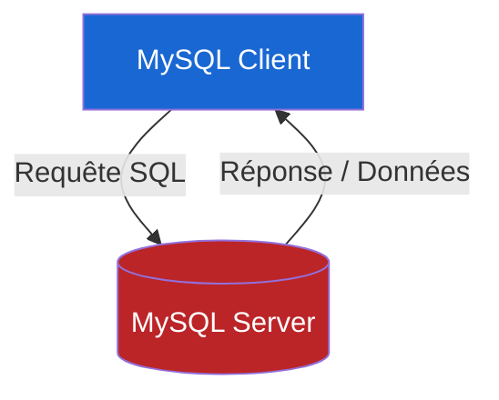

# Dossier Technique 2 : Guide d'installation et d'architecture Client-Serveur MySQL

### Introduction

Une base de données sert à conserver et à organiser les informations nécessaires à ton application.  
Tu découvriras bientôt comment interagir avec ces données à travers les cas pratiques de ce module.  
Pour commencer, il te faut installer un logiciel de gestion de bases de données, appelé **SGBD (Système de Gestion de Base de Données)**.  
Dans ce guide, nous allons installer **MySQL** en tant que SGBD, mais sache qu'il en existe d'autres comme MariaDB, PostgreSQL ou Microsoft SQL Server.  
Le principe de fonctionnement reste similaire d’un SGBD à l’autre.

> [!IMPORTANT]
> Si tu rencontres des difficultés lors de l'installation de MySQL, n'hésite pas à demander de l'aide à ton formateur !

---

### Objectifs

* 🔹 Comprendre ce qu'est un SGBD.
* 🔹 Installer et configurer MySQL.
* 🔹 Écrire ta première requête SQL de vérification.

---

### Sommaire

1. Un peu de vocabulaire
2. Architecture client-serveur de MySQL
3. Installation de MySQL Server
4. Installation du client MySQL Workbench

---

### 1. Un peu de vocabulaire

#### Rappel : Différence entre SQL, SGBD et MySQL

* **SQL** (Structured Query Language) est le langage standard pour interagir avec une base de données. Il est utilisé par tous les SGBD.
* Un **SGBD** est un logiciel qui gère la création, la maintenance et l'interrogation des bases de données en utilisant SQL.
* **MySQL** est **un** SGBD très répandu, initialement développé par MySQL AB et actuellement détenu par Oracle. Dans ce parcours, tu vas apprendre à utiliser SQL sur MySQL, mais tu pourras aussi appliquer ces connaissances à d'autres SGBD.

> [!NOTE]
> Attention, chaque SGBD peut implémenter le standard SQL de façon légèrement différente. Pour les fonctionnalités de base, ces différences sont généralement minimes.

---

### 2. Architecture client-serveur de MySQL

MySQL fonctionne sur un modèle client-serveur :

* **Le serveur MySQL** : Il stocke les données et exécute les requêtes SQL. Il ne dispose pas d’interface graphique.
* **Le client MySQL** : C'est l'outil qui te permet d'envoyer des requêtes SQL au serveur. Il reçoit et affiche les réponses du serveur.

Le processus se décompose en deux étapes fondamentales :
1. Le client envoie une requête SQL au serveur.
2. Le serveur traite la requête et renvoie la réponse au client.



---

### 3. Installation de MySQL Server

> [!CAUTION]
> Avant de continuer, assure-toi de ne pas avoir déjà installé MySQL ou un autre logiciel qui pourrait inclure un serveur MySQL (comme un package WAMP/XAMPP non configuré). Cela pourrait créer des conflits de ports par la suite.

> [!TIP]
> Suis attentivement les instructions ci-dessous selon le système d'exploitation de ta machine.

#### 💻 Option A : Système Linux (Ubuntu)

Pour installer MySQL sur Ubuntu, ouvre un terminal et exécute les commandes suivantes :

```sh
sudo apt update
sudo apt install mysql-server
```

Une fois installé, sécurise ton installation locale avec la commande suivante :

```sh
sudo mysql_secure_installation
```

Cette commande te guidera pas à pas pour configurer notamment le mot de passe de l'utilisateur `root` et désactiver certaines options non sécurisées par défaut.

*Ressource complète :* [Digital Ocean - Guide d'installation MySQL sur Ubuntu 22.04](https://www.digitalocean.com/community/tutorials/how-to-install-mysql-on-ubuntu-22-04).

#### 🍏 Option B : Système macOS

1. **Télécharger MySQL Server** : Rends-toi sur la page [MySQL Downloads](https://dev.mysql.com/downloads/mysql/) pour télécharger le serveur MySQL. Assure-toi que « macOS » est sélectionné dans *« Select Operating System »* et choisis la version correspondant à ton système (vérifiable via le menu Pomme > *« À propos de ce Mac »*). Cliquez sur *« Download »* pour obtenir l’installateur DMG.
2. **Installer MySQL Server** : Ouvre le fichier téléchargé et suis les instructions d'installation en acceptant les paramètres par défaut. Lors du processus, **définis un mot de passe robuste pour l'utilisateur `root` et note-le précieusement**.
3. **Lancement** : Après l'installation, ouvre les **Préférences Système** de ton Mac et clique sur l'icône MySQL. Si l'indicateur est rouge, clique sur *« Start MySQL Server »*. Si l'indicateur est vert, le serveur est déjà en marche.

#### 🪟 Option C : Système Windows

1. **Téléchargement** : Rends-toi sur [MySQL Installer](https://dev.mysql.com/downloads/installer/). Il est recommandé de télécharger le **second programme** proposé (la version complète de l'installeur). Lance le programme d'installation.
2. **Installation** : Sélectionne l'option **Server Only** puis clique sur **Next**. Le programme va télécharger et installer le serveur MySQL. Clique sur **Execute** pour lancer le processus. Après le téléchargement, continue avec **Next** et **Execute** pour finaliser l'installation.
3. **Configuration de la sécurité** : Une fois l'installation terminée, tu devras configurer le serveur en définissant un mot de passe pour l'utilisateur **root**.

> [!WARNING]
> Cette étape est **très importante** : choisis un mot de passe que tu pourras facilement retenir. Pour la formation, un mot de passe simple est suffisant. Après avoir défini ton mot de passe, clique sur **Next** pour finaliser l'installation.

4. **Lancement et validation** : Pour lancer MySQL, cherche **MySQL Command Line Client** dans le menu Démarrer de Windows. Sélectionne-le et saisis le mot de passe root lorsque demandé. Pour vérifier que tout fonctionne, exécute la commande suivante dans le client :

```sql
SELECT VERSION();
```

> [!NOTE]
> N'oublie pas de terminer chaque commande SQL par un point-virgule (`;`).

---

### 4. Installation du client MySQL Workbench

#### Pourquoi utiliser MySQL Workbench ?

Bien que la ligne de commande permette d'exécuter des requêtes SQL, elle présente certains inconvénients :

* **Lisibilité limitée** : Les résultats sont affichés en texte brut, ce qui peut rendre leur interprétation difficile pour des ensembles de données volumineux.
* **Erreurs de syntaxe** : L'absence d'assistance visuelle peut favoriser les erreurs lors de la saisie des commandes.
* **Absence de visualisation graphique** : Il n'est pas possible de voir facilement les relations entre les tables ou d'explorer la structure de la base de données.
* **Gestion manuelle des connexions** : À chaque nouvelle connexion, tu devez entrer tes identifiants manuellement.

**MySQL Workbench** offre une interface graphique intuitive pour :

* Écrire et exécuter des requêtes SQL avec aide à la syntaxe.
* Visualiser la structure de la base de données et les relations entre les tables.
* Gérer plus efficacement les connexions et configurations.

#### Installation du client graphique

Pour installer MySQL Workbench, rends-toi sur la page officielle [MySQL Workbench Downloads](https://dev.mysql.com/downloads/workbench/) et télécharge la version adaptée à ton système d'exploitation. De nombreux tutoriels en ligne sont disponibles pour t'aider dans cette installation.